# Plant collections data

The Darwin Tree of Life repository for an updated interactive chart of sample collection progress (which itself is in progress). 

This is what the result looks like as of 14.02.21:




To run an interactive version, go to https://observablehq.com/d/ea10047306c23584, or fire up a local server, e.g.

```bash
cd /path/to/this/cloned/github/repo
python3 -m http.server
```

Then go to http://localhost:8000/ and view results.