# Plant collections data

## Updates

20.04.21 - Full migration to using COPO as the database. Not as much data on here as in the original data recieved (./data/DToL_plant_collections), especially fewer bryophytes for some reason. Would be great to have an independent take on this.

Data flow looks like this:

Scripts ping COPO API -> return JSON files -> parsed to CSV's -> visualised in `./js/summary-plot.js`

Run the whole pipeline with:

```bash
bash update_collections_data_COPO.bash
```

Which takes ~ 1 minute with the current load of data.

21.03.21 - Attempting to get data remotely from COPO API, and format into a nice CSV.

## Main

The Darwin Tree of Life repository for an updated interactive chart of sample collection progress. 

This is what the result looks like as of 20.04.21:



To run a (minimally) interactive version, go to https://observablehq.com/d/ea10047306c23584, or fire up a local server, e.g.

```bash
cd /path/to/this/cloned/github/repo
python3 -m http.server
```

Then go to http://localhost:8000/ and view results.

### Map data

Ireland from <a href="https://github.com/deldersveld/topojson/blob/master/countries/ireland/ireland-counties.json">here</a> and UK from <a href="https://gist.githubusercontent.com/rveciana/27272a581e975835aaa321ddf816d726/raw/c40062a328843322208b8e98c2104dc8f6ad5301/uk-counties.json">here</a>.